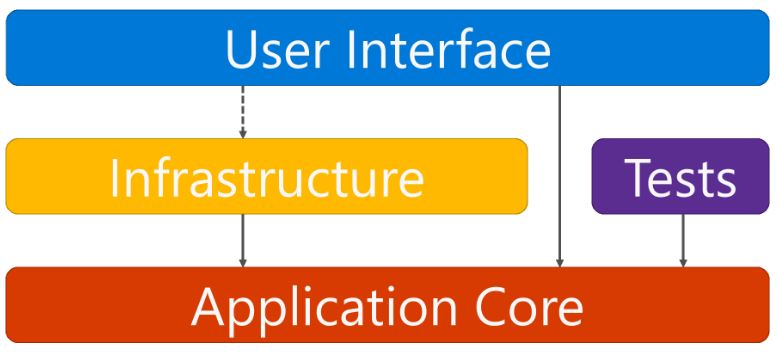
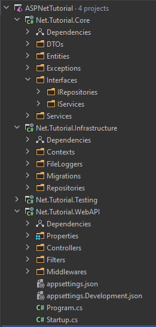

# Udemy Tutorials - chautruonglong:

- T1 - Building Restful API's with Entity Framework & ASP.Net Core
- T2 - Returning Resources
- T3 - Code First Migration
- T4 - Model Validation
- T5 - Routing and Custom Methods
- T6 - Implementing Sorting, Paging & Searching
- T7 - Caching
- T8 - Authentication and Authorization
- T9 - API Deployment
- T10 - API Documentation
- T11 - Final demo from course

# Application Architectures

- Docs: https://docs.microsoft.com/en-us/dotnet/architecture/modern-web-apps-azure/common-web-application-architectures

- Projects Reference

    

- Project Structure

    

